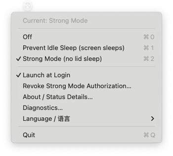
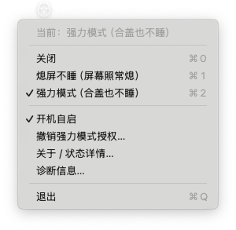

# Owly

> A tiny menu-bar app for macOS that keeps your Mac awake while letting the screen sleep.
>
> 一个极简的 macOS 菜单栏防睡眠工具：屏幕该熄熄、CPU 该跑跑、合盖也能不睡。

[中文](README.md) | **English**

[](https://www.apple.com/macos/)
[](https://www.swift.org/)
[](LICENSE)
[](https://github.com/Aarontaken/owly/releases)

---

## What It Does

Running long tasks (compilation, AI agents, downloads, training) and don't want macOS auto-sleep to interrupt them — but also don't want the screen burning power the whole time? Owly is built for exactly this.

**Three modes**, one click in the menu bar:

| Mode                    | Screen Sleeps | System Idle Sleeps | Lid Sleeps | Use Case                                        |
| ----------------------- | ------------- | ------------------ | ---------- | ----------------------------------------------- |
| Off                     | Yes           | Yes                | Yes        | Default state                                   |
| Prevent Idle Sleep      | **Yes**       | **No**             | Yes        | Long tasks — screen off saves power, CPU keeps going |
| Strong Mode             | Yes           | No                 | **No**     | Close the lid and carry — tasks keep running    |

**Key concept**: screen off ≠ system sleep. When the screen turns off the CPU is still running and tasks continue. Only system sleep freezes processes.

## Why Owly

**Better than `caffeinate -i`**: Visual menu-bar indicator, survives across power states, built-in diagnostics.

**Simpler than Amphetamine**: Three modes is all you need. No triggers, timers, or sessions. ~200 KB single binary.

**Cheaper and more transparent than commercial tools**: Free, open source, ~700 lines of Swift, sudoers scope strictly limited to two exact commands.

## Installation

### One-liner (recommended)

```bash
curl -fsSL https://raw.githubusercontent.com/Aarontaken/owly/main/install.sh | bash
```

### Option A: Download pre-built

Download the latest `Owly-vX.X.X.zip` from [Releases](https://github.com/Aarontaken/owly/releases), unzip, and drag **Owly.app** to Applications.

> **First launch**: Right-click Owly.app → Open → click "Open" in the dialog (one-time Gatekeeper bypass). The menu bar icon appears — click it and you're set.
>
> **About Gatekeeper**: This project uses ad-hoc signing (no $99/year Apple Developer certificate), so macOS will warn "cannot verify developer" on first launch. This is normal for ad-hoc signed apps. You can audit the source (~700 lines of Swift) to confirm safety before opening.

### Option B: Build from source

Requires macOS 12+ and Xcode Command Line Tools (`xcode-select --install`). **Full Xcode is not required** — just the system `swiftc`.

```bash
git clone https://github.com/Aarontaken/owly.git
cd owly
./scripts/build.sh      # compile + bundle into .app
./scripts/install.sh    # copy to /Applications + register LaunchAgent
```

## Usage

Launch the app and a menu bar icon appears. The menu supports Chinese / English switching at the bottom:





**The first time you click Strong Mode**, a native macOS admin dialog appears. Enter your password once and it's permanently password-free thereafter. The authorization is **strictly limited** to these two exact commands:

```
/usr/bin/pmset -a disablesleep 0
/usr/bin/pmset -a disablesleep 1
```

No other root privileges are granted. See [`resources/sudoers.template`](resources/sudoers.template) for the full template.

## How It Works

| Mode                 | Mechanism                                                                 |
| -------------------- | ------------------------------------------------------------------------- |
| Prevent Idle Sleep   | IOKit `IOPMAssertionCreateWithName(kIOPMAssertPreventUserIdleSystemSleep)` — equivalent to `caffeinate -i`. Process-bound; assertion auto-releases on exit. |
| Strong Mode          | `pmset -a disablesleep 1` — system-level `SleepDisabled` hard switch. Requires root; Owly uses a pre-installed sudoers rule for passwordless menu-bar toggling. |

Lid-close sleep goes through a kernel-level path in macOS. Regular `caffeinate` / IOKit assertions **cannot** prevent it — only `pmset disablesleep` works.

When the app exits, `disablesleep=0` is automatically reset. On launch, it checks for crash-residual state and cleans it up.

## Security

- **~700 lines of Swift, single file**: [`src/main.swift`](src/main.swift)
- **Ad-hoc code signature**: `codesign --force --sign -` — locally verifiable
- **Minimal sudoers scope**: exactly two commands, no wildcards, no other pmset subcommands, no other binaries
- **Auto-cleanup on exit**: IOKit assertion released on process exit, `disablesleep` reset in `applicationWillTerminate`
- **Crash recovery**: If the app starts and finds `SleepDisabled=1` but is not in Strong Mode, it resets it
- **No network access**: safe to use offline, zero telemetry

If you're unsure about sudoers, just skip Strong Mode — Prevent Idle Sleep needs no permissions at all.

## Project Structure

```
owly/
├── README.md
├── LICENSE                       # MIT
├── install.sh                    # One-liner installer (downloads from GitHub Releases)
├── .github/workflows/
│   └── release.yml               # Auto-build + release on v* tag push
├── src/main.swift                # The whole app (menu bar + IOKit + SwiftUI panels + sudoers)
├── resources/
│   ├── Info.plist
│   └── sudoers.template          # sudoers template with __USER__ placeholder
├── scripts/
│   ├── build.sh                  # swiftc compilation + .app bundle
│   ├── install.sh                # Copy to /Applications + LaunchAgent
│   ├── uninstall.sh              # Full uninstall + cleanup
│   ├── enable-lid-lock.sh        # CLI to enable Strong Mode (GUI alternative)
│   ├── disable-lid-lock.sh       # CLI to revoke Strong Mode
│   ├── distribute.sh             # Package dist/Owly-vX.X.X.zip for sharing
│   └── generate-icon.swift       # Render AppIcon.icns from SF Symbols
└── build/                        # Build artifacts (gitignored)
```

## Development

macOS 12+, Swift 5+.

```bash
# Build
./scripts/build.sh

# Install locally
./scripts/install.sh
```

Push a `v*` tag (e.g. `v1.2.0`) to trigger GitHub Actions — it auto-builds and publishes to [Releases](https://github.com/Aarontaken/owly/releases).

## Diagnostics

Menu → Diagnostics… shows at a glance:
- Current mode (in-memory state)
- Whether the IOKit assertion is active
- Current `pmset disablesleep` value
- Whether the Strong Mode sudoers rule is in effect (with actual stderr text)
- Process PID and bundle path

If something goes wrong, screenshot this window and open an issue.

## License

[MIT](LICENSE) — use it, modify it, sell it, share it. A star ⭐ is appreciated if you find it useful.

## Acknowledgments

Inspired by macOS's built-in `caffeinate` command, [Amphetamine](https://apps.apple.com/app/amphetamine/id937984704), and [KeepingYouAwake](https://github.com/newmarcel/KeepingYouAwake). Owly's difference: lighter weight, more focused on the single most common use case — "let the screen sleep, but keep the system running."
